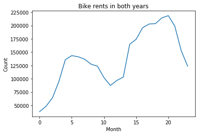
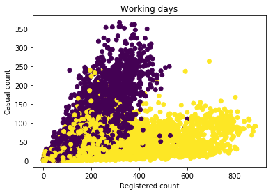
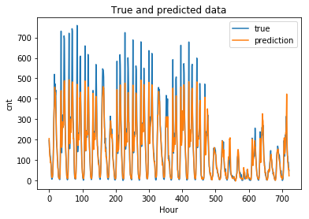

# Explanatory Data Analysis and rented bikes prediction using Long-Short Term Memory.

The goal of this work is to make an EDA of a dataset [1]. This dataset contains daily and hourly data and located in `Dataset` folder. In this work `hour.csv` was used. 

Some related pictures:

Here we can see that the data has a trend and seasonality

The graph below shows us that on non-working days the number of casual (not registered) users is bigger. We can use this information, for example to make a special weekend-offer for casual users to attract even more customers. 

Please, see `data_analysis.ipynb` to get more information about the data.

## Prediction
Training, evaluation and model loading are in `lstm.ipynb`.

The current result is depicted on the picture.

The obtained mean absolute error is 28.08

## Requirements
The libraries were used:
- `numpy==1.13.3`
- `pandas==0.20.3`
- `matplotlib==2.1.0`
- `Keras==2.2.4`
- `tensorflow==1.9.0`
- `scikit-learn==0.19.0`

## References
[1] Fanaee-T, Hadi, and Gama, Joao, "Event labeling combining ensemble detectors and background knowledge", Progress in Artificial Intelligence (2013): pp. 1-15, Springer Berlin Heidelberg, doi:10.1007/s13748-013-0040-3.
